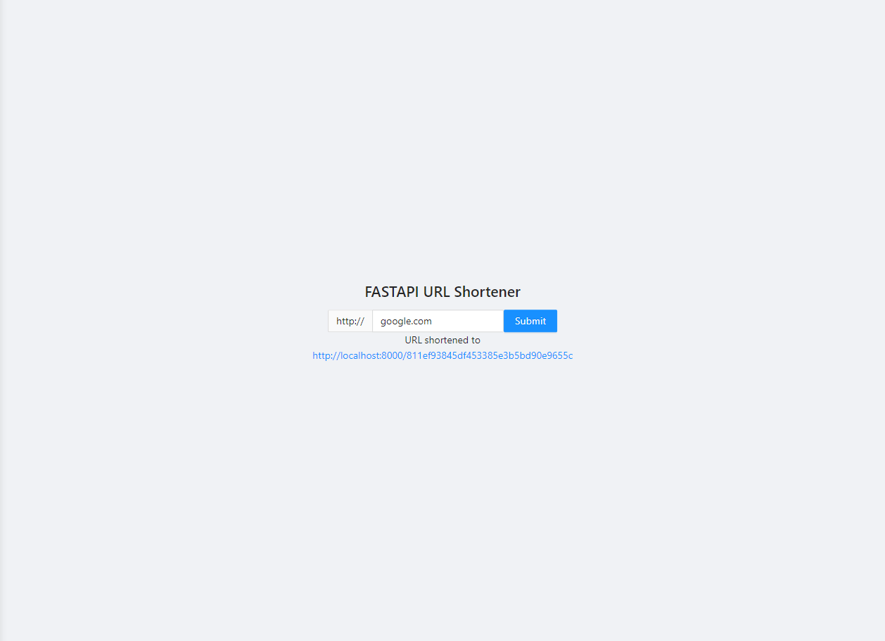

<h3 align="center">URL-shortener with Python FASTAPI</h3>

  

    URL shortener web application using Python FASTAPI, React.Js & SQLite.
  

<!-- ABOUT THE PROJECT -->

## About The Project

This project was done for self practice and is meant to be deployed locally.

### Built With

- [React.js](https://reactjs.org/)
- [FastAPI](https://fastapi.tiangolo.com/)

<!-- GETTING STARTED -->

## Getting Started

### Prerequisites

- Python PIP
- npm

### Frontend

1. `cd frontend`
2. `npm i `
3. `npm start`

### Backend

1. `cd backend`
2. `pip install -r requirements.txt`
3. `uvicorn app.main:app --reload`

- Access localhost URL https://localhost:3000
